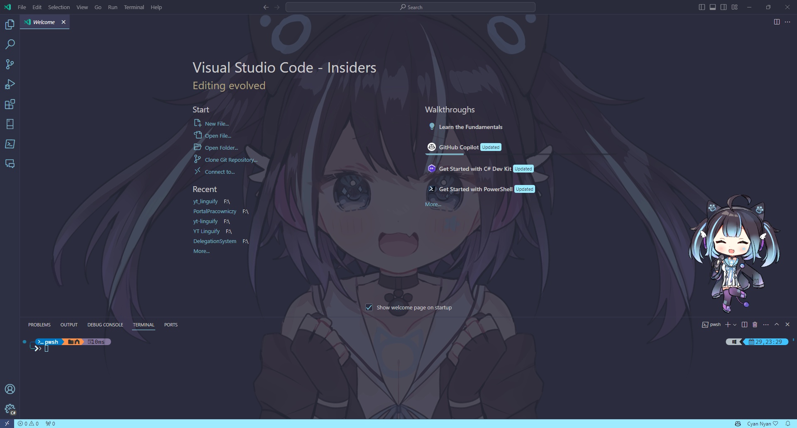
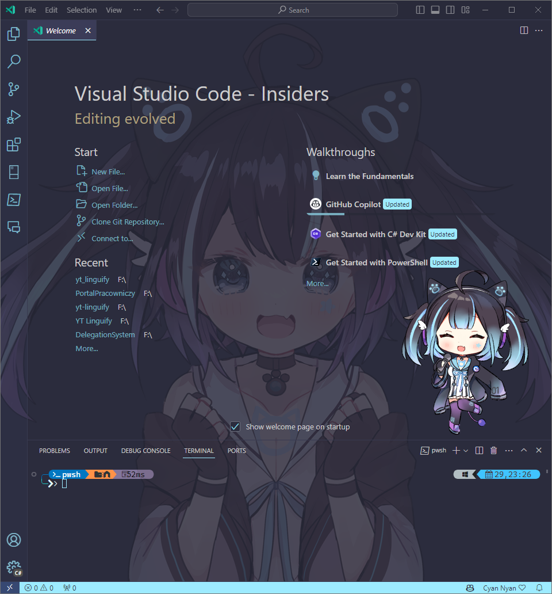
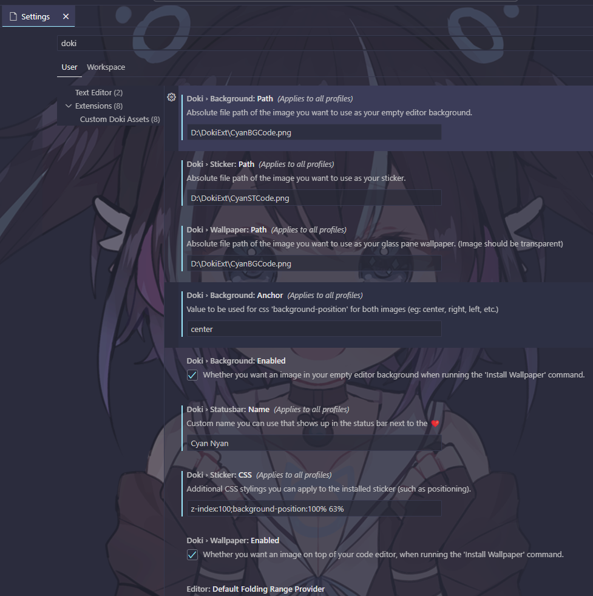

# Doki Theme with Cyan Background

Enhance your Visual Studio Code experience using Doki Theme and Cyan background and sticker!




## Configuration Guide

### 1. Install the Doki Theme Extension for Visual Studio Code
- [Doki Theme Extension](https://marketplace.visualstudio.com/items?itemName=unthrottled.doki-theme)

Additional note, Doki Theme works with more applications, such as
   - JetBrains IDEs
   - Visual Studio 
   - Chrome, Edge, Brave, Firefox
   - Github
   - Vim, NeoVim

This tutorial focus mainly on Visual Studio Code, but nothing stops you from using it everywhere else!
For more informations I recommend visiting official GitHub repo [Doki Theme](https://github.com/doki-theme)

And for more detailed instructions for VS Code, check out the [Doki Theme Documentation](https://marketplace.visualstudio.com/items?itemName=unthrottled.doki-theme#custom-assets).

### 3. Save Theme Images
Save the theme images located in the `Images` folder to your preferred directory.

### 4. Set the Doki Theme
Doki Theme works seamlessly with most custom themes. In the screenshots, I used Doki Theme: NekoPara: Vanilla.

### 5. Open Command Palette
Use the shortcut `Ctrl + Shift + P`.

## Option 1 (UI way):

### Update User Settings


1. Select: Preferences: Open User Settings.
2. Press Enter.
3. In the search bar, type "Doki".
4. Insert image paths into:
    - Sticker
    - Wallpaper
    - Background
5. Set Anchor value to: `center`.
6. Optionally, adjust sticker position:
    ```css
    z-index:100;background-position:100% 63%
    ```
7. Change Status bar: Name value to `Cyan Nyan`.
8. Open Command Palette and run Doki-Theme: Restore Assets.
9. Finish!

## Option 2 (JSON way):

### Edit User Settings (JSON)
1. Select: Preferences: Open User Settings (JSON).
2. Press Enter.
3. Paste the following at the bottom:
    ```json
    "doki.statusbar.name": "Cyan Nyan",
    "doki.sticker.path": "your-path//CyanSticker.png",
    "doki.wallpaper.path": "your-path//CyanBackground.png",
    "doki.background.path": "your-path//CyanBackground.png",
    "doki.background.anchor": "center"
    ```
4. Optionally, disable the sticker:
    ```json
    "doki.wallpaper.enabled": false
    ```
5. Or adjust its position:
    ```json
    "doki.sticker.css": "z-index:100;background-position:100% 63%"
    ```
6. Finish!

## Special Thanks
- [Doki Theme developers](https://github.com/doki-theme/doki-theme-vscode)
- [Hacker Neko Waifu Cyan](https://cyan.yt/)
- Sticker made by [@yuyuzu11](https://twitter.com/yuyuzu11)
- Background made by [?](?)
- Instructions and image crop by [Mixxy3k](https://github.com/Mixxy3k)
